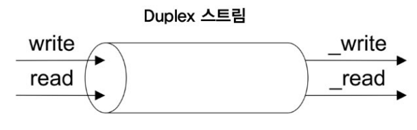
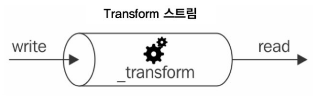
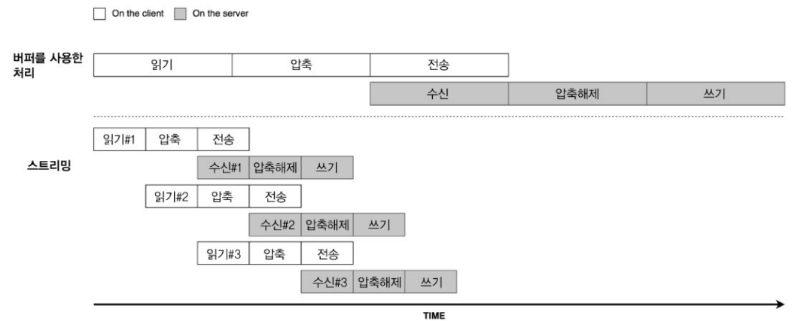

# 6-1

## 6-1-1 버퍼링 대 스트리밍

- 버퍼링은 일부 데이터가 리소스에 수신되어 버퍼에 저장된 후, 남은 데이터 청크들이 최종적으로 읽어진 다음 전송된다.
- 스트림은 리소스에서 데이터가 도착하자마자 데이터를 처리할 수 있다. (모든데이터가 수집될 때 까지 기다리지 않는다.)
- 순전히 효율성 관점에서 스트림은 공간과 시간 측면에서 더 효율적일 수 있다.

## 6-1-2 공간 효율성

- 스트림을 사용하면 데이터를 버퍼링하고 한번에 처리할 때는 불가능한 일을 할 수 있습니다.
- 예를들어, 수백메가, 기가 바이트 정도의 매우 커다란 파일을 읽어야 하는 경우를 생각해 볼게요
- 분명히 파일을 완전히 읽을 때 큰 버퍼를 반환한다는 것은 좋은 생각이 아닙니다.
- 게다가 이러한 파일을 몇개씩 동시에 읽을 때는 쉽게 메모리가 부족해 질 것입니다.

```jsx
// 버퍼의 실제 최대 크기는 Nods.js 플랫폼과 버전에 따라 달라지므로 한번 확인해보세요!
import buffer from "buffer";
console.log(buffer.constants.MAX_LENGTH);
```

## 6-1-3 시간 효율성

- 버퍼의 경우 클라이언트에서 파일을 압축해서 데이터를 보내면, 받아서 압축해제 후 파일에 쓸 때 까지 모든 데이터를 기다려야 한다.
- 스트림 방식을 이용하면 클라이언트 쪽에서 파일을 읽고, 압축하고 ,전송을 각각의 데이터 청크마다 수행하고, 전송하면, 서버에서도 각각의 데이터 청크를 받을 때 마다 조립하기 시작해서 압축을 풀고, 파일에 쓸 수 있는 것 이다.



## 6-2 스트림

- 스트림은 핵심 모듈부터 시작하여 Node.js의 모든 곳에 존재합니다.
- fs모듈의 createReadStream(), createWriteStream(), HTTP요청 및 응답 객체는 기본적으로 스트림이고, zlib 모듈을 사용하면 스트림 인터페이스를 사용하여 데이터를 압축 및 압축 해제할 수 있습니다.

### Node.js의 네가지 기본 추상 클래스 (스트림)

- Readable
- Writable
- Duplex
- Transform

## 6-2-2 Readable 스트림

- 데이터 소스를 나타냅니다.
- Readable 추상 클래스를 사용하여 구현됩니다.
- non-flowing(paused) 모드와 flowing 모드가 있습니다.

### non-flowing 모드

- 읽기를 위한 기본 패턴
- 스트림에 읽을 수 있는 새로운 데이터가 있다는 것을 나타내는 readable 이벤트에 대해 리스너를 연결하는 작업 포함
- 그 후, 루프에서 내부 버퍼가 비워질 때 까지 데이터를 계속 읽음 (동기적 작업)

```jsx
readable.read([size]);
```

- 이 접근 방식을 사용하면 요청 시 스트림에서 데이터를 강제로 가져옵니다.

### flowing 모드

- 데이터 이벤트에 리스터를 연결하는 것, 이렇게하면 스트림이 flowing 모드를 사용하도록 전환.
- read()로 데이터를 가져오지 않고, 도착하자마자 데이터 리스너로 바로 전달됩니다.

## 6-2-3 Writable 스트림

- 대상 데이터의 목적지를 나타냅니다.

```jsx
writable.write(chuck, [encoding], [callback]);
```

### 배압(Backpressure)

- Node.js 스트림이 소비할 수 있는 것 보다 더 빨리 데이터가 기록되는 병목현상
- 대처방법은 데이터를 버퍼링 하는 것.
- 그러나 스트림이 데이터 생성자에게 피드백을 제공하지 않는 한, 내부 버퍼에 점점 더 많은 데이터가 축척되어 원하지 않는 수준의 메모리 사용량이 발생하는 상황이 온다.
- 이를 방지하기 위해 writable.write()는 내부 버퍼가 크기 제한을 초과하면 false를 반환합니다.
- false를 반환하면 애플리케이션이 쓰기를 중지해야 한다는 신호이고, 버퍼가 비워지면 drain 이벤트가 발생하여 다시 쓰기를 시작해도 안전함을 알립니다.

## 6-2-4 Duplex 스트림

- 중복스트림으로써 읽기 및 쓰기가 가능
- 네트워크 소켓과 같은 데이터 소스이자 데이터 목적지인 엔티티를 설명하려는 경우 유용하다.
- Readable, Writable 상속
- 스트림에서 읽은 데이터와 스트림 안에 기록된 데이터 사이에 즉각적인 관계가 없다.
  

## 6-2-5 Transform 스트림

- 데이터 변환을 처리하도록 특별히 설계된 특수한 종류의 Duplex 스트림이다.
- 쓰기 가능한 쪽에서 받은 각 데이터 청크에 일종의 변환을 적용한 다음, 변환된 데이터를 읽기 가능한 쪽에서 사용할 수 있도록 한다.
- \_read()와 \_write()를 제공하는 대신 \_transform()과 \_flush()를 제공해야 한다.
- 단순화된 생성자에서는 \_가 붙지 않음



## 6-2-6 PassThrough 스트림

- 변환을 적용하지 않고 모든 데이터 청크를 출력하는 특수한 유형의 변환
- 관찰이 가능하고 느린 파이프 연결과 지연 스트림을 구현하는데 유용하다.

### 관찰 가능성

- 하나 이상의 스트림을 통해 흐르는 데이터의 양을 관찰하려면 데이터 이벤트 리스터를 PassThrough 인스턴스에 연결한 다음 스트림 파이프 라인의 원하는 지정된 지점에서 이 인스턴스를 파이프라인으로 연결하여 수행할 수 있습니다.
- 파이프라인의 다른 기존 스트림을 건드릴 필요가 없다.
- 압축되지 않은 데이터의 바이트 수를 알고 싶을 때 적은 노력으로 가능하다.

## 6-2-7 지연 스트림

- 동시에 다수의 스트림을 생성해야 하는 경우
- 파일 시스템의 파일들로부터 많은 수의 스트림을 전달하려는 경우 EMFILE 이라는 너무 많은 파일열기 오류가 발생할 가능성이 있음
- 스트림 인스턴스를 만든다는 것은 실제로 그러한 스트림 사용을 시작하기 전에도 비용이 많이 드는 작업을 바로 초기화 한다.
- 그렇지만 이것은 나중에 사용할 수 있도록 많은 수의 스트림 인스턴스를 먼드는 경우에는 바람직 하지 않다.
- lazystream과 같은 라이브러리를 사용하면 프록시에서 데이터를 소비하기 시작할 때까지 프록시 된 인스턴스가 생성되지 않게 한다.

## 6-2-8 파이프를 사용하여 스트림 연결하기

```jsx
readable.pipe(writable, [options]);
```

- 매우 직관적으로 pipe() 함수는 Readable 스트림에서 방출된 데이터를 가져와서 제공된 Writable 스트림에 전달합니다.
- Readable 스트림이 종료 이벤트를 발생시키면 Writable 스트림도 자동으로 종료됩니다.
- 배압을 제어할 필요가 없다.

### 파이프 오류 처리

- 자동으로 오류가 파이프를 통해 전파되지 않음.
- 그렇게 되면 .on(error, cb)를 통해 파이프 하나마다 처리를 해줘야 하는데 보기가 안좋음

- pipeline 함수를 이용해 해결

```jsx
pipeline(stream1, stream2, stream3..., cb)
```

- 에러일 경우 cb 호출
