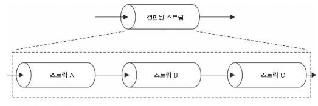

# 6-2

## 6-3 스트림을 사용한 비동기 제어 흐름 패턴

- 스트림을 활용하여 비동기제어흐름 ⇒ 흐름제어로 바꿀 수도 있습니다.

## 6-3-1 순차적 실행

- Readable.from()을 이용해서 배열에서 Readable 스트림을 만듭니다.
- Transform 스트림의 _transform() 함수는 이전 호출이 callback()을 호출하여 완료될 때까지 다음 데이터 청크를 가지고 호출되지 않습니다.
- 즉 기다리면서 순서대로 실행됩니다.
- 여기서는 done 함수를 호출함으로써 처리완료를 알리고 다음스트림을 실행시킵니다.

```jsx
.pipe(new Transform({ // ②
    objectMode: true,
    transform(filename, enc, done) {
      const src = createReadStream(filename)
      src.pipe(destStream, { end: false })
      src.on('error', done)
      src.on('end', done) // ③
    }
  }))
```

## 6-3-2 순서가 없는 병렬 실행

- NodeJs의 동시성을 최대한 활용하기 위해서, 또한 모든 데이터 청크에 대해 느린 비동기 작업을 실행해야하는 경우, 실행을 병렬화하여 전체 프로세스 속도를 높이는 것이 유리합니다.
- 순서가 중요할 경우 병렬스트림은 사용하면 안됩니다.

## 6-3-3 순서가 없는 제한된 병렬 실행

- 242p의 check-url 프로그램을 수백만 개의 url로 돌리면 문제가 발생할 것입니다.
- 그러므로 스트림실행을 제한해야합니다.
- concurrency로 최대프로세스 수 제한

```jsx
if (this.running ‹ this. concurrency) {
	done();
}
```

## 6-3-4 순서가 있는 병렬 실행

- 때때로는 데이터 청크를 수신한 순서로도 내보내야 하는경우가 있습니다.
- 우리가 해야할 작업은 내보내는 데이터를 정렬하여 데이터가 수신된 것과 동일한 순서를 따르게 하는 것입니다.
- parallel-transform 라이브러리를 사용합니다.
- 여기서 중요한것은 출력의 순서와 입력의 순서가 보장된다고 하더라도 이러한 비동기 작업들은 여전히 병렬로 실행됩니다.

## 6-4-1 스트림 결합

- 스트림은 서로 다른 패턴들을 조합하여 함께 파이프로 연결할 수 도 있습니다.
- 한 스트림의 흐름을 둘 이상의 파이프로 분할하거나 조건 따라 흐름을 리다이렉션 할 수 있습니다.



- 결합된 스트림에 쓸 때는 실제 파이프라인의 첫번째 스트림에 씁니다. (Writable)
- 결합된 스트림에서 읽을 때는 실제로 파이프라인의 마지막 스트림에서 읽습니다. (Readable)
- pipe()나 pipeline() 도우미 함수는 마지막 스트림만 반환한다. 따라서 마지막 Readable 컴포넌트만 얻게된다.
- **`pumpify`**는 이러한 스트림 조합과 연결 작업을 간편하게 수행할 수 있도록 도와줍니다. 여러 개의 스트림을 하나의 파이프라인으로 연결하여 데이터 흐름을 손쉽게 구성할 수 있습니다.

### pipeline()과 pumpify()의 차이점

- **`pipeline()`**은 스트림을 연결하고 데이터 흐름을 자동으로 처리하며, 오류 처리를 관리합니다.
- **`pumpify()`**는 스트림을 순차적으로 연결하는 데에 중점을 두고 있으며, 오류 처리를 개발자가 직접 처리해야 합니다.
- **`pipeline()` 은 비동기적으로 여러개의 스트림들을 자동으로 처리하고, 에러처리를 적절히 수행합니다.**
- **`pipeline()`**은 비동기적으로 동작하며, 콜백 함수나 **`Promise`**를 사용하여 완료 시점을 처리할 수 있습니다.
- **`pumpify`**는 여러 개의 스트림을 순차적으로 연결하고, 데이터를 전달하며, 최종 스트림에서 완료 이벤트를 처리하는 데 도움을 줍니다.
- . **`pumpify`**는 동기적으로 동작하며, 스트림 간의 오류 처리를 자동으로 관리하지 않습니다.

- 동기 vs 비동기, 오류처리가능 vs 따로해줘야함, 연결하는데 중점 vs 순차적처리 등의 차이

## 6-4-4 멀티플렉싱 디멀티플렉싱

- 여러 스트림을 결합하는 것이 아닌 공유 채널을 사용하여 일련의 스트림들의 데이터를 전달하는 방법
- 단일 스트림을 통한 전송을 허용하기 위해 여러 스트림을 결합하는 작업을 멀티플렉싱, 공유스트림에서 수신된 데이터를 원래의 스트림으로 재구성 하는 작업을 디멀티플렉싱이라고 합니다.