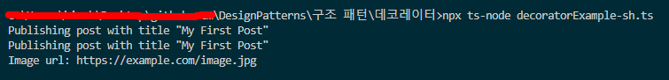

# 데코레이터 패턴

- **데코레이터**는 객체들을 새로운 행동들을 포함한 특수 래퍼 객체들 내에 넣어서 위 행동들을 해당 객체들에 연결시키는 구조적 디자인 패턴입니다.
- 데코레이터 패턴(Decorator Pattern)은 객체의 행동을 동적으로 확장하는 구조적인 디자인 패턴입니다. 이 패턴은 객체를 래핑하여 객체에 추가적인 기능을 동적으로 부여하며, 이를 통해 기존 코드를 수정하지 않고 객체에 새로운 기능을 추가할 수 있습니다.

## 데코레이터 패턴 구성요소

블로그에는 여러가지 유형의 게시물이 존재할 수 있습니다. 예를 들어, 일반 게시물, 이미지 게시물, 동영상 게시물, 광고 게시물 등이 있을 수 있습니다.

- **interface** Post : 모든 객체들이 구현해야할 인터페이스
- **class** BasicPost : 이미지 유형, 일반 유형, 동영상 유형 할 것 없이 그냥 게시물
- **class** ImagePostDecorator : 이미지 유형 데코레이터, 게시물을 래핑한다!

## 요약

- 어렵습니다.
- 이렇게 이해하면 될까요? 구루의 예시처럼 슬랙, 페이스북, 이메일 알람을 구현해야 하는 상황에서 그냥 Notifier 클래스에 추가하지말고 데코레이터를 따로두어서 데코레이터의 인자로 Notifier객체를 받으면 유연한 확장이 가능하다구요. 그게 래핑 한다는거죠?
- 예를들어 slackDecorator, facebookDecorator 하고 인자로 new Notifier 객체를 주면 각각의 해당하는 객체로 래핑되서 기능을 수행할 수 있다구요?

## 결과

