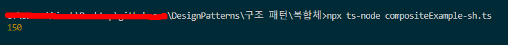

# 복합체 패턴

- **복합체** 패턴은 객체들을 트리 구조들로 구성한 후, 이러한 구조들과 개별 객체들처럼 작업할 수 있도록 하는 구조 패턴입니다.
- 객체들을 트리 구조로 구성하여, 개별 객체들과 복합 객체들을 모두 같은 방법으로 다룰 수 있도록 하는 패턴입니다.

## 복합체 패턴 구성요소

- **abstract** **class** FileSystemObject : 복합체 객체 ( 폴더, 파일 모두 다룰 수 있다. )
- **class** Files **extends** FileSystemObject : 파일 시스템 ( 하나의 파일 )
- **class** Folder **extends** FileSystemObject : 폴더 시스템 ( 여러 파일을 자식으로 갖는 폴더 )

## 요약

- 구루 예제는 너무 길고 복잡해서 현기증이나네요..
- 중요한점은 트리형태의 계층구조, 부모노드, 자식노드 할 것 없이 복합체 객체는 접근할 수 있다 입니다.
- 재귀적으로 타고들어가면서 클라이언트가 요구한 동작을 수행하는데 모두 복합체 클래스를 상속 받기 때문에 클라이언트가 복합체에게 시킨 동작을 수행할 수 있습니다.

- 그런데 생성자의 인자로 private, pubilc 이렇게 주면 클래스의 멤버변수가 되는 건가요?

```jsx
constructor(name: string, private size: number(이런거?)) {
    super(name);
  }
```

## 결과


