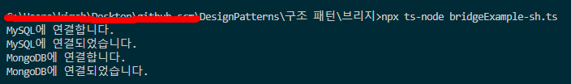

# 브리지 패턴

- **브리지**는 큰 클래스 또는 밀접하게 관련된 클래스들의 집합을 두 개의 개별 계층구조(추상화 및 구현)로 나눈 후 각각 독립적으로 개발할 수 있도록 하는 구조 디자인 패턴입니다.
- 어떠한 기능을 추상화하고 다른 파트에서 구현한다

## 브릿지 패턴 구성요소

- **interface** DatabaseConnector : 모든 DB 커넥터들은 connect() 라는 메서드를 제공하여 연결을 지원한다.
- concreate connector : 몽고디비 커넥터나, MySQL 커넥터와 같은 구체적인 커넥터 제품 ( 인터페이스 구현 )
- **abstract** **class** DatabaseConnection : DB연결을 추상화한다.

## 새로운 용어(개념)
- 전체를 잘 이해해야 하므로 **모놀리식** 코드베이스는 간단한 변경을 하는 것조차 매우 어렵습니다. 반면에 잘 정의된 작은 모듈들을 변경하는 것이 훨씬 쉽습니다.
- 이 예시는 브리지 패턴이 기기와 리모컨을 관리하는 앱의 **모놀리식** 코드를 나누는 데 어떻게 도움이 되는지 보여줍니다. Device 클래스들은 구현의 역할을 하는 반면, Remote클래스들은 추상화 역할을 합니다.
### 모놀리식 아키텍처
- 모놀리식 아키텍처는 모든 비즈니스 관련 사항을 함께 결합하는 하나의 코드 베이스를 갖춘 대규모의 단일 컴퓨팅 네트워크입니다.
- 이러한 종류의 애플리케이션을 변경하려면 코드 베이스에 액세스하고 서비스 측 인터페이스의 업데이트된 버전을 구축 및 배포하여 전체 스택을 업데이트해야 합니다.

## 요약

- **`DatabaseConnector`**인터페이스와 **`DatabaseConnection`**추상 클래스 둘 다 추상화된 개념이지만, 그 역할과 의도는 약간 다릅니다.

**`DatabaseConnector`** 인터페이스는 데이터베이스와의 연결을 추상화하고, **`connect()`** 메서드를 정의하여 실제 데이터베이스와의 연결 기능을 구현하는 클래스에서 구현하도록 강제하는 역할을 합니다. 이 인터페이스를 통해 다양한 데이터베이스와 연결할 수 있는 클래스를 만들 수 있습니다.

반면, **`DatabaseConnection`** 추상 클래스는 추상화된 데이터베이스 연결 기능을 가진 객체를 나타냅니다. 이 클래스를 상속받아 실제 데이터베이스와의 연결 기능을 구체화하는 클래스를 만들 수 있습니다. 이렇게 추상화된 데이터베이스 연결 기능을 가진 객체와 각각의 실제 데이터베이스와의 연결 기능을 분리하여 설계하면, 추상화된 데이터베이스 연결 기능을 가진 객체를 유연하게 확장할 수 있습니다.

- 연결 기능을 가진 객체를 유연하게 확장할 수 있다? ⇒ 예를 들어 어떤기능?
- 예를들어 추상클래스에서 connect 메서드를 강제하고 몽고디비에서는 연결 요청후 1분후에 연결하고 싶다라고 하면 settimeout 1분을 걸어서 커스터마이징 할 수있다는건가?
- 데이터베이스 연결기능 === 이렇게 해야 연결할 수 있다. ( 커넥터 )
- 커넥터의 시험을 모두 통과한, 커넥터의 기능을 갖고있는 객체 === 커넥션 객체

### 어느정도 해결

```jsx
abstract class DatabaseConnection {
  abstract connect(): void;
  abstract query(queryString: string): void;
}

class MySQLConnection extends DatabaseConnection {
  connect(): void {
    // MySQL 데이터베이스와 연결하는 코드
  }

  query(queryString: string): void {
    // MySQL 데이터베이스에서 쿼리 실행하는 코드
  }
}

class PostgreSQLConnection extends DatabaseConnection {
  connect(): void {
    // PostgreSQL 데이터베이스와 연결하는 코드
  }

  query(queryString: string): void {
    // PostgreSQL 데이터베이스에서 쿼리 실행하는 코드
  }
}
```

이렇게 하면 DatabaseConnection 객체를 상속받은 다른 여타 연결객체를 수정하지 않고도 포스트 그레에 해당하는 연결객체를 만들어주기만 하면 유연한 확장이 가능하다!

## 결과


