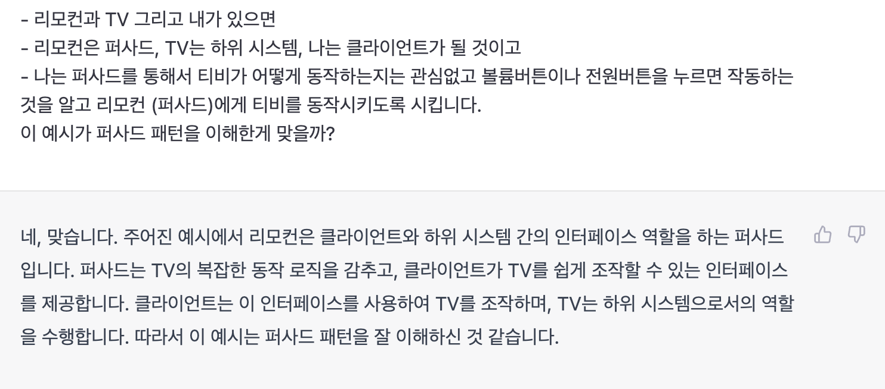
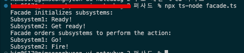

# 퍼사드 패턴

- **퍼사드**패턴은 라이브러리에 대한, 프레임워크에 대한 또는 다른 클래스들의 복잡한 집합에 대한 단순화된 인터페이스를 제공하는 구조적 디자인 패턴입니다.
- 퍼사드는 앱의 전반적인 복잡성을 줄이는 동시에 원치 않는 의존성들을 한 곳으로 옮기는 것을 돕습니다.
- 퍼사드 패턴은 일반적으로 타입스크립트 코드로 작성된 앱에서 사용되며 또 복잡한 라이브러리 및 API와 작업할 때 특히 편리합니다.
- **퍼사드 패턴은 하위 시스템을 계층들로 구성하려는 경우 사용하세요.**

## 퍼사드 패턴 구성요소

- **class Facade : 여러개의 서브시스템의 복잡한 로직에 대응하는 간단한 인터페이스 제공**
- **class Subsystem1, class Subsystem2 : 여러개의 서브시스템들**
- **clientCode : 퍼사드와 상호작용하여 서브시스템을 동작을 명령함**

## 요약

- 간단 명료한 패턴인 것 같습니다.
- 클라이언트 - 퍼사드 - 다양하고 복잡한 하위시스템들로 구성되어 있습니다.
- 퍼사드를 가운데의 매개체로 두고 클라이언트 코드가 하위시스템으로부터 원하는 작업을 명령합니다.
- 클라이언트 코드는 퍼사드를 통해서만 하위 시스템과 상호작용 합니다.

- 예를들어 이런것이 아닌가 싶습니다. ⇒ 리모컨과 TV 그리고 내가 있으면
- 리모컨은 퍼사드, TV는 하위 시스템, 나는 클라이언트가 될 것이고
- 나는 퍼사드를 통해서 티비가 어떻게 동작하는지는 관심없고 볼륨버튼이나 전원버튼을 누르면 작동하는 것을 알고 리모컨 (퍼사드)에게 티비를 동작시키도록 시킵니다.

## 결과

