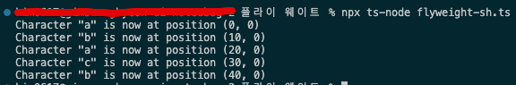

# 플라이 웨이트 패턴

- **플라이웨이트**는 각 객체에 모든 데이터를 유지하는 대신 여러 객체들 간에 상태의 공통 부분들을 공유하여 사용할 수 있는 RAM에 더 많은 객체들을 포함할 수 있도록 하는 구조 디자인 패턴입니다
- 앱이 수많은 유사 객체들을 생성해야 할 때
- 이것이 대상 장치에서 사용할 수 있는 모든 RAM을 소모할 때
- 이 객체들에 여러 중복 상태들이 포함되어 있으며, 이 상태들이 추출된 후 객체 간에 공유될 수 있을 때
- 플라이웨이트 패턴의 유일한 목적은 메모리 섭취를 최소화하는 것입니다. 당신의 프로그램이 RAM 부족으로 문제를 겪지 않는다면 당분간 이 패턴을 무시할 수 있습니다.

## 플라이 웨이트 패턴 구성 요소

- **class TextEditor : flyweight 클래스 ⇒ 공유속성을 담고있다.**
- **class Character : flyweight factory class ⇒ 고유속성을 담고있다.**
- 클라이언트 코드 : flyweight객체 생성후 메서드 호출

## 요약

- 음.. 예시는 좀 어지럽습니다. 팍토리메서드 패턴과 협업을 하는 패턴이네요
- flyweight 클래스는 공통속성을 관리하고 메서드로 객체들의 고유 속성을 받아서 작업합니다.
- flyweight.factory 클래스는 객체만의 고유속성을 관리합니다.
- 클라이언트 코드는 flyweight와 상호작용 하면서 객체들을 생성하는데, 공유되는 속성은 더이상 만들지 않고 기존의 객체를 반환합니다.

## 결과

