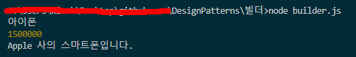

# 빌더 패턴

- **빌더**는 복잡한 객체들을 단계별로 생성할 수 있도록 하는 생성 디자인 패턴입니다. 이 패턴을 사용하면 같은 제작 코드를 사용하여 객체의 다양한 유형들과 표현을 제작할 수 있습니다.
- 빌더 패턴을 사용하는 것은 제품에 매우 복잡하고 광범위한 설정이 필요한 경우에만 의미가 있습니다.

## 빌더 구성 요소

- 제품 ( Product ) 클래스 : 제품이 만들어져서 반환되는, 즉 만들어진 제품
- 제품 제작 ( ProductBuilder ) 클래스 : 제품을 실제로 만드는 클래서
- 클라이언트 코드에서 ProductBuilder를 호출해서 순서나 입맛에 맞게 메서드 체이닝을 통해 호출하여 최종적으로 build를 수행하여 제품을 만들게 된다.

## 요약

1. 우선, 복잡한 객체를 생성할 때, 제품을 만들 때 특정 순서를 지켜야 하거나, 조건에 따라 어떠한 부분이 포함되지 않는 다거나 할 때 유용하게 사용할 수 있습니다.
2. 제품 제작 클래스에서는 예를들어 자동차를 생성한다고 하면 자동차에는 핸들, 몸체, 네비게이션 등이 있다고 하면, 몸체 → 핸들 → 네비게이션 순서대로 만들어야해! 라고 지정할 수 도 있고, 네비게이션이 없는 자동차를 만들어야지! 라는 객체도 생성할 수 있게 됩니다.
3. 디렉터 클래스가 있는데 역할은 빌더클래스의 제어입니다. 그런데 필수사항은 아닙니다. 클라이언트 코드에서 충분히 제어할 수 있기 때문입니다.

## 결과

