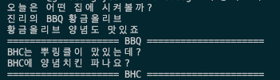

# 추상 팩토리 패턴

- **추상 팩토리**는 관련 객체들의 구상 클래스들을 지정하지 않고도 관련 객체들의 모음을 생성할 수 있도록 하는 생성패턴입니다.

## 추상 팩토리 구성 요소

1. 추상 팩토리 공장 ( 인터페이스 )
2. 특정 형식 공장 ( 클래스 ) - 추상 팩토리 공장 인터페이스 구현 : 예를들어 A식, B식 스타일의 제품을 만들어내는 역할
3. 추상 제품 ( 인터페이스 ) : 특정 제품을 의미. 의자면 의자 소파면 소파
4. 특정 형식 제품 ( 클래스 ) - 추상 제품 인터페이스 구현 : 특정 제품 특정 형식을 의미
5. 클라이언트 코드 : 특정 형식 ( A식, B식 ) 으로 주문을 넣으면 내부에서 그 형식에 맞는 제품을 만든다.

## 예제 설명 - 치킨 시나리오

- ChickenFactory : 치킨을 생산하는 공장 ( 추상 팩토리 ) - 후라이드, 양념 생산
- BBQ, BHC 클래스 : 추상팩토리를 구현하는 특정 제품들을 생산하는 공장
- 후라이드, 양념 인터페이스 : 후라이드, 양념치킨이면 구현해야하는 기능 정의
- BBQ 후라이드, BHC 양념 : 후라이드 또는 양념 인터페이스를 구현
- 배달 : 추상팩토리타입의 치킨집을 매개변수로 받아서 각집 ( BHC, BBQ ) 의 치킨을 만들어서 각자의 메소드도 실행시킬 수 있다.

## 실행결과

