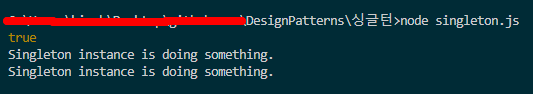

# 싱글턴 패턴

- **싱글턴**은 클래스에 인스턴스가 하나만 있도록 하면서 이 인스턴스에 대한 전역 접근(액세스) 지점을 제공하는 생성 디자인 패턴입니다.
- **싱글턴은 같은 종류의 객체가 하나만 존재하도록 하고 다른 코드의 해당 객체에 대한 단일 접근 지점을 제공하는 생성 디자인 패턴입니다.**
- 싱글턴은 전역 변수들과 거의 같은 장단점을 가지고 있습니다: 매우 편리하나 코드의 모듈성을 깨뜨립니다.
- 싱글턴은 같은 캐싱 된 객체를 반환하는 정적 생성 메서드로 식별될 수 있습니다.

## 싱글턴 구성 요소

- 싱글턴 클래스
  - **private** **static** instance : 싱글턴의 getInstance메서드가 return 할 클래스를 컨트롤할 객체
  - **private** **constructor : 생성자는 항상 private로 막아둔다. (접근하지 못하도록)**
  - someBusinessLogic : 싱글턴 클래스로 만든 클래스의 실제 비즈니스 로직
- 클라이언트 코드
  - S1, S2 모두 싱글턴의 getInstance 메서드를 호출하여 반환된 객체
  - 따라서 둘은 같은 객체이고 싱글턴 패턴이 잘 적용되었다.

## 요약

1. 싱글턴 패턴의 개념은 간단합니다. 하나의 클래스가 있을 때, new 생성자로 클래스의 인스턴스를 생성하는 것이 아니라, getInstance메서드로 오직 하나의 객체만을 운영합니다.
2. 그리고 싱글턴 클래스의 멤버변수인 (타입이 싱글턴클래스인) instance를 통해 싱글턴 클래스 내에 있는 여러 비즈니스 로직들을 실행할 수 있습니다.
3. 이 때, 다른 여러곳에서 싱글턴 클래스의 getInstance메서드를 이용해서 만든 인스턴들은 모두 같은 객체를 공유합니다.

## 싱글턴 리뷰 QnA
1. 싱글턴의 단일 책임 원칙 위반
- https://refactoring.guru/ko/design-patterns/singleton
  - 클래스에 인스턴스가 하나만 있도록 합니다. 
  - 해당 인스턴스에 대한 전역 접근 지점을 제공합니다.
  - 최근에는 싱글턴 패턴이 워낙 대중화되어 패턴이 나열된 문제 중 한 가지만 해결하더라도 그것을 싱글턴이라고 부를 수 있습니다.
2. 싱글턴 프론트엔드 적용
  - https://hyeon.pro/dev/singleton-pattern/
    - 장점이 없다... window 객체로 모두 접근이 가능하며, JS 언어 구조상 쓰레드 경합이 일어나지 않음
  - https://devowen.com/425
    - 또 리덕스가 만족스럽지 않은 두 번째 이유는 리덕스 스토어는 싱글톤 패턴을 따르기 때문이다.
    - 여담이지만 블로그 주인 오웬 님 칼럼 잘 쓰십니다.

## 결과

