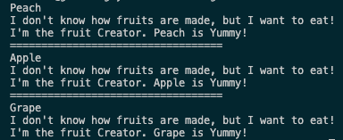

# 팩토리 메서드 패턴

- 가상 생성자, Factory Method
- **팩토리 메서드**는 부모 클래스에서 객체들을 생성할 수 있는 인터페이스를 제공하지만, 자식 클래스들이 생성될 객체들의 유형을 변경할 수 있도록 하는 생성 패턴입니다.

## 팩토리 메서드 구성요소

1. 제품 ( 인터페이스 )
2. 생성자 ( 추상클래스 )
3. 특정 제품 생성자 ( 클래스 )
4. 특정제품 ( 클래스 ) ⇒ 제품 구현
5. 클라이언트 코드

## 예제 설명 - 과일 시나리오

- Fruit : 과일 제품 인터페이스 담당 - 모든 과일들은 yummy라는 메서드를 공통으로 가집니다.
- Tree : 과일을 만드는 나무 ( 추상클래스 )
  - createFruit : 실질적으로 제품을 만드는 메서드
  - eat : 실질적으로 과일이 생성되고 특정과일 안의 메서드 실행
- **PeachTree, AppleTree, GrapeTree : Tree 추상클래스를 상속하는 특정 과일나무 abstract 메서드 구현**
- **Peach, Apple, Grape : 실질적인 과일( 제품 ) 생성 모든 과일은 과일 인터페이스에 있는 yummy 메서드를 구현한다.**
- hungryPerson : 클라이언트 코드로써 배고픈 사람이 과일을 주문하고 먹게된다.

## 실행결과

