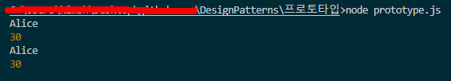

# 프로토 타입 패턴

- **프로토타입**은 코드를 그들의 클래스들에 의존시키지 않고 기존 객체들을 복사할 수 있도록 하는 생성 디자인 패턴입니다.
- 프로토타입 패턴은 실제로 복제되는 객체들에 복제 프로세스를 위임합니다.
- **프로토타입은 객체들(복잡한 객체 포함)을 그의 특정 클래스들에 결합하지 않고 복제할 수 있도록 하는 생성 디자인 패턴입니다.**
- 프로토타입 패턴(Prototype Pattern)은 생성할 객체의 종류가 많거나, 객체 생성 과정이 복잡하거나, 객체를 생성하기 위한 정보가 동적으로 변하는 경우에 유용한 디자인 패턴입니다. 이 패턴은 기존 객체를 복제(clone)하여 새로운 객체를 생성합니다.

## 프로토 타입 구성 요소

- 클론메서드를 갖고있는 추상클래스나 인터페이스 : clone 메서드를 선언합니다.
- 실제 구현클래스 ( 추상클래스나 인터페이스 상속하여 clone 메서드 구현)
- 실제 구현클래스의 객체를 만들고 clone 메서드를 호출하면 그 객체의 복사본이 만들어진다.

## 요약

1. 프로토 타입은 원형이라는 뜻으로, 원형이 되는, 기준이 되는 객체가 있으면 그 객체를 복사하여 새로운 객체를 만들어냅니다.
2. 보통은 clone 메서드를 이용해서 동일한 객체를 생성합니다.
3. 드는 의문점은 두가지입니다.
   - 동일한 객체이지만 동일한 멤버변수로 인해 원형과 정확히 똑같은 형식으로 작동한다고 해도 그 객체는 동일한 객체일까요? 메모리 주소 값도 다를건데요. 단순한 눈속임이 아닐까요?
   - 왜 굳이 클래스까지 써가면서 객체를 복사할까요? object.create, assign이나 spread 연산자를 쓰면 객체를 동일하게 복사할 수 있는데요?

## 결과

