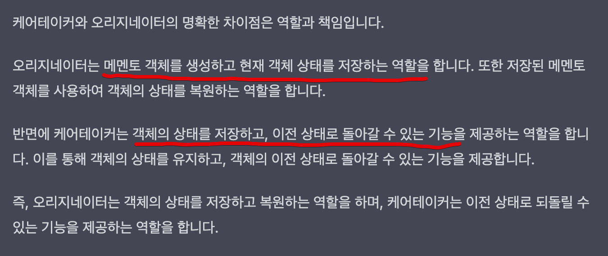

# 메멘토 패턴

- **메멘토**는 객체의 구현 세부 사항을 공개하지 않으면서 해당 객체의 이전 상태를 저장하고 복원할 수 있게 해주는 행동 디자인 패턴입니다.

## 메멘토 패턴 구성요소

- **class Originator : 메멘토 객체를 생성시키고, 복구하고, 어떤 작업을 하는 역할**
- class **ConcreteMemento : 하나하나의 작업기록이라고 생각하시면 될 것 같아요**
- class **Caretaker : 메멘토 배열을 관리하는, 즉 작업물 기록을 관리하는 ( 백업하거나, 되돌리거나, 로그를 보여주거나 ) 케어테이커 클래스입니다.**

## 요약

- 오리지네이터는 객체의 상태를 저장하고 복원하는 역할을 하며, 케어테이커는 이전 상태로 되돌릴 수 있는 기능을 제공하는 역할을 합니다.
- 메멘토 패턴은 오리지네이터와 메멘토클래스 그리고 케어테이커로 구성됩니다.
- gpt도 케어테이커와 오리지네이터의 차이점을 명확이 구분하지 못하는 느낌입니다.
- 두개 모두 객체의 상태를 저장한다죠?

- 아! 그렇다면 오리지네이터는 어떠한 작업을 하는 행동입니다.
- 메멘토는 오리지네이터가 작업했던 하나의 결과물입니다.
- 케어테이커는 메멘토들을 배열로 관리하는 하나의 거대한 메멘토 history store 입니다.
- 어떤가요??

## 결과

