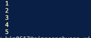

# 반복자 패턴

- **반복자**는 컬렉션의 요소들의 기본 표현(리스트, 스택, 트리 등)을 노출하지 않고 그들을 하나씩 순회할 수 있도록 하는 행동 디자인 패턴입니다.
- **반복자 패턴은 당신의 컬렉션이 내부에 복잡한 데이터 구조가 있지만 이 구조의 복잡성을 보안이나 편의상의 이유로 클라이언트들로부터 숨기고 싶을 때 사용하세요.**

## 반복자 패턴 구성요소

- **Iterator : 반복자 인터페이스로써 반복자 클래스가 가져야할 메서드 정의**
- **Collection : 복잡한 데이터들**
- **CollectionIterator : 콜렉션을 순회할 수 있는 반복자 클래스**

## 요약

- 오케이 셋중에 중간정도의 난이도 같네요
- 반복자 패턴은 이터레이터와 컬렉션 두개로 구성됩니다. 구성은 간단하죠
- 하나의 컬렉션 (배열이든 트리든 그래프든)에는 하나의 이터레이터가 필요합니다.
- 이터레이터는 기본적으로 배열을 순회할 수 있는 메서드를 갖고 있습니다.
- 하나의 컬렉션에는 하나의 이터레이터 입니다. 왜냐하면 동일한 컬렉션을 서로다른 이터레이터를 사용해서 순회하면 상태가 공유되기때문에 예상치 다른 이터레이터의 처리 때문에 또 다른 이터레이터는 낭패를 겪을 수 도 있습니다.

## 결과

