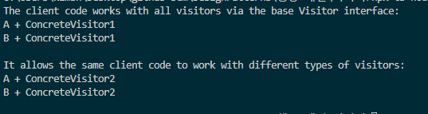

# 비지터 패턴

- **비지터** (방문자) 패턴은 알고리즘들을 그들이 작동하는 객체들로부터 분리할 수 있도록 하는 행동 디자인 패턴입니다.
- **비지터 객체는 복잡한 객체 구조(예: 객체 트리)의 모든 요소에 대해 작업을 수행해야 할 때 사용하세요.**

## 비지터 패턴 구성요소

- **interface** Component : 컴포넌트들은 비지터들을 받아들일 accept메서드를 구현한다
- class concreateComponent : 상속받은 accept 메서드뿐만아니라, 다른 메서드들도 구현 가능
- **interface** Visitor : 각 컴포넌트들을 방문할 visitA, visitB … 등의 모든 컴포넌트들을 방문할 준비를 해놓음
- **class** ConcreteVisitor : visitA, visitB … 들의 메서드들의 상세구현을 책임집니다. 각각의 비지터의 메서드들은 같다고 볼 수 있습니다. 맞죠?

## 요약

- 비지터 패턴은 컴포넌트가 있고 비지터들이 있는데, 각각 여러개일 수 있습니다.
- 비지터 패턴은 말그대로 방문한다는 의미이고, 여러개의 비지터는 모든 컴포넌트들을 방문할 권한을 갖고있고, 다수의 비지터 모두 같은 메서드들을 갖고있습니다. 각각의 비지터에서 컴포넌트에 대한 동작이 다르겠죠?
- 그래서 똑같은 클라이언트코드 함수가 있다고 했을때, 비지터만 바꿔주는것으로 같은 컴포넌트에 대해서 다른동작을 취할 수 있는 것 이죠.

## 결과

