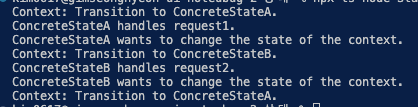

# 상태 패턴

- **상태**패턴은 객체의 내부 상태가 변경될 때 해당 객체가 그의 행동을 변경할 수 있도록 하는 행동 디자인 패턴입니다. 객체가 행동을 변경할 때 객체가 클래스를 변경한 것처럼 보일 수 있습니다.

## 상태 패턴 구성 요소

- **class Context : 객체들의 천이를 관리하는 ( 상태의 변경 ) 역할**
- **abstract class State : 객체들의 상태를 별도의 클래스로 분리**
- **class ConcreteState : 특정 상태**

## 요약

- 클라이언트 코드는 컨텍스트를 만듭니다. 컨텍스트는 객체들의 천이를 관리하는 역할을 맡습니다. ( 현재는 State A 로 초기화 되었습니다. )
- 컨텍스트는 요청을 처리받습니다. request1 ⇒ 현재 state의 handle1 메서드를 처리합니다.
- handle1 메서드는 일을 처리한 뒤 B상태로 천이됩니다. 그 다음 클라이언트 코드의 request2 메서드가 호출되면서
- state B 의 handle2 메서드가 호출되고, 다시 state A 로 천이됩니다.

- 상태에 따라 다른 행동을 하고, 그 상태의 천이는 컨텍스트가 관리합니다.
- 각각의 구체적인 상태들은 State라는 추상클래스를 상속받음으로써 똑같은 동작을 물려받습니다. (handle1, handle2)

- 구루 설명은 이해가 안됐는데, 코드를 보니까 느낌을 잡았습니다.

## 결과

