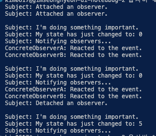

# 옵서버 패턴

- **옵서버**패턴은 당신이 여러 객체에 자신이 관찰 중인 객체에 발생하는 모든 이벤트에 대하여 알리는 구독 메커니즘을 정의할 수 있도록 하는 행동 디자인 패턴입니다.
- **옵서버 패턴은 한 객체의 상태가 변경되어 다른 객체들을 변경해야 할 필요성이 생겼을 때, 그리고 실제 객체 집합들을 미리 알 수 없거나 이러한 집합들이 동적으로 변경될 때 사용하세요.**

## 옵서버 패턴 구성요소

- **interface observerSubject : "observer" 패턴을 구현하기 위한 인터페이스로, Subject(주제)와 Observer(관찰자) 객체 간의 통신을 가능하게 합니다. Subject 객체에서 상태가 변경되면 Observer 객체들에게 자동으로 알림을 보내게 됩니다.**
- **class ConcreteSubject : 특정 주제 ⇒ 출판사라고 보면 되겠죠?**
- **interface Observer : 구독정보를 받고 싶어하는 객체들**
- class concreateobserver : 구독정보를 받고 싶어하는 구체적인 개체

## 요약

- 인기도가 별이 3개네요 - 첨보네요
- 왜 근데 옵저버가 아니라 옵서버인지 궁금하네요 ㅋㅋ
- 클라이언트 코드는 옵저버 객체 1,2 를 소환합니다.
- 그 후, Subject에 이 두명을 구독시킵니다. ⇒ Subject를 출판사라고 하겠습니다.
- 그 후, 출판사들은 somebusinessLogic을 수행하는데, 수행하고 나면 나의 구독자들에게 알려줍니다.
- 알려준다는 말은 update메서드를 호출한다는 말입니다.
- 그러면 구독자들은 반응합니다. 끝~

## 결과

