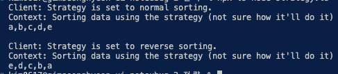

# 전략 패턴

- **전략**패턴은 알고리즘들의 패밀리를 정의하고, 각 패밀리를 별도의 클래스에 넣은 후 그들의 객체들을 상호교환할 수 있도록 하는 행동 디자인 패턴입니다.
- **전략 패턴은 객체 내에서 한 알고리즘의 다양한 변형들을 사용하고 싶을 때, 그리고 런타임 중에 한 알고리즘에서 다른 알고리즘으로 전환하고 싶을 때 사용하세요.**

## 전략 패턴 구성 요소

- **class Context : 전략을 선택하고 전략에 따라 다른 동작을 실행**
- **interface Strategy : 전략인터페이스로써 실행할 알고리즘 정의**
- **class ConcreteStrategy : 알고리즘 실제 구현 ⇒ 컨텍스트 객체가 알려줌**

## 요약

- 상태패턴이랑 느낌이 비슷하네요
- 전략은 단순히 클라이언트가 컨텍스트에게 전략만 전달하고 컨텍스트는 해당 전략에게 알고리즘을 실행하라고 명령합니다.
- 상태도 마찬가지로 컨텍스트가 request를 하면 상태들이 반응하여 작업을 수행합니다.
- 그렇지만 전략은 특정 선택된 알고리즘 하나를 실행한다면, 상태는 똑같은 작업이라도 상태에 따라서 다르게 동작하고, 그렇기 때문에 상태가 언제든지 천이될 수 있다는 점 이 차이점 같습니다.
- 전략 : 1전략 1실행
- 상태 : 1상태 n실행 ( 상태의 수 만큼 )

## 결과

