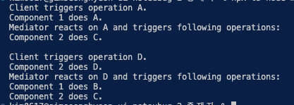

# 중재자 패턴

- **중재자**는 객체 간의 혼란스러운 의존 관계들을 줄일 수 있는 행동 디자인 패턴입니다. 이 패턴은 객체 간의 직접 통신을 제한하고 중재자 객체를 통해서만 협력하도록 합니다.
- **중재자 패턴은 일부 클래스들이 다른 클래스들과 단단하게 결합하여 변경하기 어려울 때 사용하세요.**
- 더 나아가 중재자가 컴포넌트 객체들의 생성 및 파괴를 담당하도록 할 수 있으며, 그러면 중재자는 **[팩토리](https://refactoring.guru/ko/design-patterns/abstract-factory)** 또는 **[퍼사드](https://refactoring.guru/ko/design-patterns/facade)**와 유사할 수 있습니다.

## 중재자 패턴 구성요소

- **interface Mediator : 중재자 클래스가 가져야할 소양을 정의**
- **class ConcreteMediator : 구체적인 중재자 클래스 - 컴포넌트가 어떤 동작을 수행한다고 중재자에게 공지하면 → 중재자는 적절한 동작을 취합니다.**
- **class BaseComponent : 컴포넌트들이 가져야할 소양을 정의**
- class concreateComponent : 구체적인 명령을 하달받아서 실행하는 컴포넌트 → 그 후 중재자 에게 나 이거 한다고 알려준다.

## 요약

- 모든 디자인 패턴의 국룰, 중간에 뭐 둬서 걔보고 처리하게 하기가 또 나왔네요
- 중재자 패턴은 두 개로 나뉘죠?
  - 명령을 수행할 컴포넌트
  - 명령을 하달할 중재자
- 컴포넌트에게 클라이언트가 명령을 하달하면? ⇒ 이것은 버튼을 누른다거나, 체크박스를 체크한다거나 하는 동작입니다.
- 컴포넌트는 즉각 중재자에게 notify (공지) 합니다.
- 공지를 받은 중재자는 적힌 코드에 따라서 동작을 하겠죠? doB한다음 doC 할 수도 있고요 아무것도 안할수도 있겠죠?
- 이벤트에 따라서, 즉 공지하는 컴포넌트에 따라서 하는 동작이 달라지고, 수백 수천개의 컴포넌트에 대해서 하나의 중재자만이 명령을 내릴 수 있게 하는 디자인 패턴인듯 싶습니다.
- 그런데 뭐 공지하는거말고도 컴포넌트들은 본인만의 고유의 작업을 한 뒤에 중재자에게 공지하는 것 같네요
- 그래서 이패턴이 필요한 이유는 컴포넌트들이 알아서 할일을 하면서 여러 컴포넌트들끼리 연관된 작업을 할 때 이렇게 중재자 하나로 추상화 시켜서 작업을 단순화 시키는 그런 느낌이네요?
- 예를들어 전체동의라는 버튼이 있다고 가정했을 때, 버튼을 누르면 다른 컴포넌트인 체크박스들이 모두 체크되어야겠죠? 그럴때 클라이언트께서 버튼을 누르시면 버튼이 눌림을 감지하고 전체동의 컴포넌트는 중재자에게 버튼이 눌렸다고 공지합니다.
- 그리고 중재자는 전체동의 컴포넌트가 눌렸을 때 (if event === “전체동의”) 일때의 동작을 수행하겠죠
- 예를들어 this.checkbox.doCheckAll() 이런거요?

- 한가지 기시감이 드는건 중재자 패턴에 이렇게 이벤트 타입에 따라서 if else 로 계속 분기하는데 약간 리덕스 액션 타입에 따라서 다른 동작을 수행하는 그런 느낌인것같네요? 어떠신가요?

## 결과

