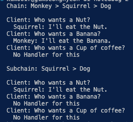

# 책임 연쇄 패턴

- **책임 연쇄** 패턴은 핸들러들의 체인(사슬)을 따라 요청을 전달할 수 있게 해주는 행동 디자인 패턴입니다. 각 핸들러는 요청을 받으면 요청을 처리할지 아니면 체인의 다음 핸들러로 전달할지를 결정합니다.
- **책임 연쇄 패턴은 당신의 프로그램이 다양한 방식으로 다양한 종류의 요청들을 처리할 것으로 예상되지만 정확한 요청 유형들과 순서들을 미리 알 수 없는 경우에 사용하세요.**
- **이 패턴은 특정 순서로 여러 핸들러를 실행해야 할 때 사용하세요.**
- **책임 연쇄 패턴은 핸들러들의 집합과 그들의 순서가 런타임에 변경되어야 할 때 사용하세요.**

## 책임 연쇄 패턴 구성 요소

- **interface Handler : 모든 핸들러들이 갖고 있어야할 메서드 정의 (보통은 handler 메서드 한개만으로 구성)**
- **AbstractHandler : Handler 인터페이스 상속, 세부 메서드 구현**
- 세부 핸들러 : **AbstractHandler의 핸들러 메서드를 오버라이딩하여 구현**

## 요약

- 나름 명료한 패턴 이네요
- 핸들러는 보통은 요청을 처리할 handler 메서드 하나를 갖지만, 프로그램에 따라 다음 요청을 처리하게 하는 setNext 메서드도 있을 수 있습니다.
- 그리하여 세부핸들러 (monkey handler 등)들은 본인이 처리할 수 있는 요청이면 처리를 하고 그렇지 않다면 부모의 추상핸들러로 요청을 넘기고 만약 setNext(다음객체) 가 있다면 다음객체로 요청을 차례로 보내고, 아니라면 그 요청은 처리할 수 없는 요청으로 처리합니다.
- 핸들러의 세부 구현에 따라서 자유롭게 프로그램을 구성할 수 있을 듯 보입니다.
- 예를들어 next를 지정하던지 안하던지, 본인 요청이 맞아서 처리를 했고 → 그다음에 또 super.handle()을 해서 next 객체를 불러서 handler를 또 처리하게 할 수도 있어서 만드는 방식에 따라서 여러가지 순서와 방식, 처리결과를 보여줄 수 있을 것 같네요

- 근데 구루예시에서 abstract handler를 왜 굳이 추상클래스로 구현했을까요? 추상메서드도 없는데요

## 결과

