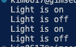

# 커맨더 패턴

- **커맨드**는 요청을 요청에 대한 모든 정보가 포함된 독립실행형 객체로 변환하는 행동 디자인 패턴입니다. 이 변환은 다양한 요청들이 있는 메서드들을 인수화 할 수 있도록 하며, 요청의 실행을 지연 또는 대기열에 넣을 수 있도록 하고, 또 실행 취소할 수 있는 작업을 지원할 수 있도록 합니다.
- 실행 취소/다시 실행을 구현하는 방법에는 여러 가지가 있지만, 커맨드 패턴이 아마도 가장 많이 사용되는 패턴일 것입니다

## 커맨드 패턴 구성요소

- **interface Command : 커맨드 메서드가 포함해야할 단 1개의 메서드 execute를 포함**
- **Receiver : 클라이언트의 요청을 받아서 처리하는 객체, 비즈니스 로직이 포함되어 있습니다.**
- Concrete Command : 클라이언트가 요구할 구체적인 동작을 의미 - 불을켜라, 꺼라
- **Invoker : 커맨드를 실행한다. 즉 명령하는 객체, 리시버들을 시키는 객체**

## 요약

- 슬쩍 어렵네요
- 이것도 리모콘 느낌이네요 퍼사드 패턴에서도 리모콘 예시를 들었는데 퍼사드에서는 하위 기능들 ( 불을 켜고 끈다 라고했을 때 )이 어떻게 구현되어있는지는 관심없고 나는 그 동작이 실행되길 원한다! 이런느낌인데
- 행동패턴의 커맨드는 다양한 리시버 ( 불을 끄는객체 불을 켜는객체 ) 들에게 명령을 내려서 실행할 수 있도록 중간의 인터페이스를 제공한 다는 느낌이네요
- 많은 디자인 패턴이 그러하듯 중간에 인터페이스를 두는건 똑같군요. 그 중간의 인터페이스가 무슨역할을 수행하는가는 조금씩, 아주조금씩 다른것 같지만 말입니다.

## 결과

