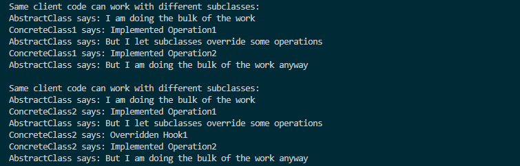

# 템플릿 메서드 패턴

- **템플릿 메서드**는 부모 클래스에서 알고리즘의 골격을 정의하지만, 해당 알고리즘의 구조를 변경하지 않고 자식 클래스들이 알고리즘의 특정 단계들을 오버라이드(재정의)할 수 있도록 하는 행동 디자인 패턴입니다.
- **템플릿 메서드 패턴은 클라이언트들이 알고리즘의 특정 단계들만 확장할 수 있도록 하고 싶을 때, 그러나 전체 알고리즘이나 알고리즘 구조는 확장하지 못하도록 하려고 할 때 사용하세요.**
- *훅*이라는 또 다른 유형의 단계가 있습니다. 훅은 몸체가 비어 있는 선택적 단계입니다. 템플릿 메서드는 훅이 오버라이드 되지 않아도 작동합니다. 일반적으로 훅들은 알고리즘의 중요한 단계들의 전 또는 후에 배치되어 자식 클래스들에 알고리즘에 대한 추가 확장 지점들을 제공합니다.

## 템플릿 메서드 구성요소

- **abstract** **class** AbstractClass : 템플릿 메서드를 갖고있는 추상클래스
- **class** ConcreteClass : 상속받은 추상클래스에 있는 추상메서드들을 오버라이딩 해야하고, 정의되어있는 것은 바꾸면 안된다.
- clientCode : 서브클래스 ( 구상클래스 )들을 바꿔가면서 실행하는 역할

## 요약

- 템플릿 메서드를 갖고있는 추상클래스를 중심으로하여 여러가지의 구체적인 클래스들이 등장하여서 추상클래스의 여러기능을 상속받거나 오버라이딩해서, 똑같은 클라이언트 코드라도 구체적인 클래스에 따라 동작을 달리한다는 디자인패턴.
- 일반적인 건축계획 : 추상클래스
- 클라이언트의 니즈 : 구체적인 서브 클래스
- 약간 유사한 패턴이 있었던것같기도해서 찾아봤는데 못찾았습니다.
- 약간 부모클래스에서 정의해두고 자식이 상속받아서 확장시켜가는 그런느낌이네요

## 결과

